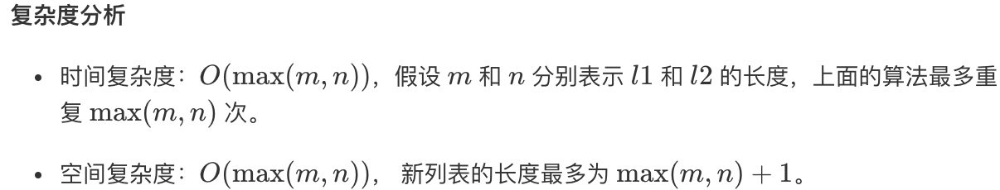

# 2. 两数相加-May 1st, 2020

> 原题链接：[两数相加](https://leetcode-cn.com/problems/add-two-numbers/)

### 题目描述

给出两个 **非空** 的链表用来表示两个非负的整数。其中，它们各自的位数是按照**逆序**的方式存储的，并且它们的每个节点只能存储**一位**数字。

如果，我们将这两个数相加起来，则会返回一个新的链表来表示它们的和。

您可以假设除了数字 0 之外，这两个数都不会以 0 开头。

示例：

```
输入：(2 -> 4 -> 3) + (5 -> 6 -> 4)
输出：7 -> 0 -> 8
原因：342 + 465 = 807
```

### 尝试

#### May 1st, 2020 Attempt1

```python
# Definition for singly-linked list.
# class ListNode:
#     def __init__(self, x):
#         self.val = x
#         self.next = None

class Solution:
    def addTwoNumbers(self, l1: ListNode, l2: ListNode) -> ListNode:
        sum = 0
        i = 1
        while(l1 != None):
            sum += l1.val * i 
            i *= 10
            l1 = l1.next
        i = 1
        while(l2 != None):
            sum += l2.val * i 
            i *= 10
            l2 = l2.next
        l = ListNode(0)
        l3 = l 
        while(sum !=0):
            l3.val = sum % 10
            sum = sum//10
            if(sum!=0):
                l3.next = ListNode(0)
                l3 = l3.next
        return l
```

> 我的想法：先求出两数之和，再按照得到的和重新构建链表

#### May 1st, 2020 Attempt2

```python
# Definition for singly-linked list.
# class ListNode:
#     def __init__(self, x):
#         self.val = x
#         self.next = None

class Solution:
    def addTwoNumbers(self, l1: ListNode, l2: ListNode) -> ListNode:
        sum = 0
        i = 1
        while((l1 != None) & (l2 != None)):
            sum = sum + l1.val * i + l2.val * i
            i *= 10
            l1 = l1.next
            l2 = l2.next
        while(l1 != None):
            sum += l1.val * i 
            i *= 10 
            l1 = l1.next
        while(l2 != None):
            sum += l2.val * i 
            i *= 10
            l2 = l2.next
        l = ListNode(0)
        if sum==0:
            return l
        l3 = l 
        while(sum !=0):
            l3.next = ListNode(sum % 10)
            sum = sum//10
            l3 = l3.next
        return l.next
```

> 我的想法：根据Attempt1中的算法进行优化，取消不必要的尾结点，以及`i`不需要重新置1

>基于Attempt1 和 Attempt2 发现算法是写出来了，目的达到，但是时间和空间仍有很大提升空间，这不是一个好的算法。
>
>> 执行结果：通过
>>
>> 执行用时 :76 ms, 在所有 Python3 提交中击败了58.89%的用户
>>
>> 内存消耗 :13.7 MB, 在所有 Python3 提交中击败了5.13%的用户

### 更优的算法

```python
class Solution:
    def addTwoNumbers(self, l1, l2):
        """
        :type l1: ListNode
        :type l2: ListNode
        :rtype: ListNode
        """
        re = ListNode(0)
        r=re
        carry=0
        while(l1 or l2):
            x= l1.val if l1 else 0
            y= l2.val if l2 else 0
            s=carry+x+y
            carry=s//10
            r.next=ListNode(s%10)
            r=r.next
            if(l1!=None):l1=l1.next
            if(l2!=None):l2=l2.next
        if(carry>0):
            r.next=ListNode(1)
        return re.next
```

> [原文链接](https://leetcode-cn.com/problems/add-two-numbers/solution/liang-shu-xiang-jia-by-leetcode/)
>
> **思路**：我们使用变量来跟踪进位，并从包含最低有效位的表头开始模拟逐位相加的过程。
>
> > 就像你在纸上计算两个数字的和那样，我们首先从最低有效位也就是列表 l1l1 和 l2l2 的表头开始相加。由于每位数字都应当处于 0 \ldots 90…9 的范围内，我们计算两个数字的和时可能会出现 “溢出”。例如，5 + 7 = 125+7=12。在这种情况下，我们会将当前位的数值设置为 22，并将进位 carry = 1carry=1 带入下一次迭代。进位 carrycarry 必定是 00 或 11，这是因为两个数字相加（考虑到进位）可能出现的最大和为 9 + 9 + 1 = 199+9+1=19。
>
> **伪代码**：
>
> > + 将当前结点初始化为返回列表的哑结点。
> > + 将进位 carrycarry 初始化为 0.
> > + 将 pp 和 qq 分别初始化为列表 l1 和 l2的头部.
> > + 遍历列表 l1 和 l2 直至到达它们的尾端。
> >     + 将 x设为结点 p 的值。如果 p 已经到达 l1 的末尾，则将其值设置为 0。
> >     + 将 y 设为结点 q的值。如果 qq 已经到达 l2 的末尾，则将其值设置为 0。
> >     + 设定 sum = x + y + carry。
> >     + 更新进位的值，carry = sum / 10。
> >     + 创建一个数值为 (sum mod 10)的新结点，并将其设置为当前结点的下一个结点，然后将当前结点前进到下一个结点。
> >     + 同时，将 p 和 q 前进到下一个结点。
> > + 检查 carry = 1是否成立，如果成立，则向返回列表追加一个含有数字 1 的新结点。
> > + 返回哑结点的下一个结点。
>
> **复杂度**：
>
> 

