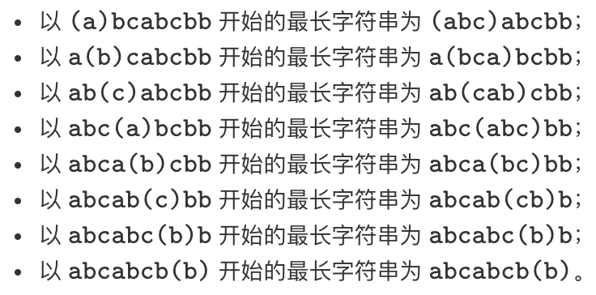
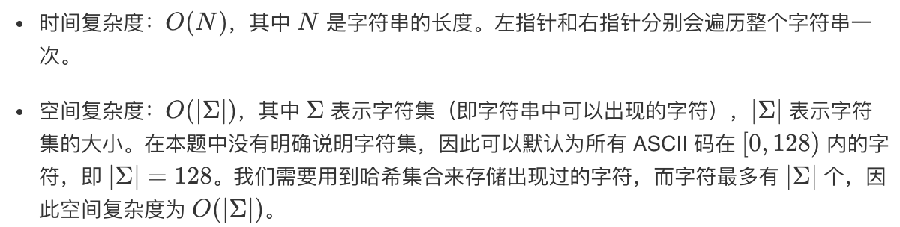

# 3. 无重复字符的最长子串-May 3rd, 2020

> 原题链接：[无重复字符的最长子串](https://leetcode-cn.com/problems/longest-substring-without-repeating-characters)

### 题目描述

给定一个字符串，请你找出其中不含有重复字符的 **最长子串** 的长度。

示例：

```
输入: "abcabcbb"
输出: 3 
解释: 因为无重复字符的最长子串是 "abc"，所以其长度为 3。
```

```
输入: "bbbbb"
输出: 1
解释: 因为无重复字符的最长子串是 "b"，所以其长度为 1。
```

```
输入: "pwwkew"
输出: 3
解释: 因为无重复字符的最长子串是 "wke"，所以其长度为 3。
     请注意，你的答案必须是 子串 的长度，"pwke" 是一个子序列，不是子串。
```

### 尝试

#### May 3rd, 2020 Attempt1-python3

```python
class Solution:
    def lengthOfLongestSubstring(self, s: str) -> int:
        if s == '':
             return 0
        s1 = ''
        s2 = ''
        for i in range(len(s)):
            if s[i] not in s2:
                s2 = s2 + s[i]
            else:
                if len(s2) > len(s1): 
                    s1 = s2
                for j in range(len(s2)):
                    if s2[j] == s[i]:
                        s2 = s2[j:] + s[i]
                        s2 = s2[1:]
                        break
        return max(len(s1), len(s2))
```

> 我的想法：用两个字符串来存储字符串。例如：**“abcdcefgea”**
>
> 我们令s1为当前的非重复最长字符子串
>
> 我们令s2为当前向前匹配运动的字符子串
>
> **步骤：**
>
> > + 对字符串参数s进行循环遍历，如果当前字符不在s2中，我们把这个字符添加到s2中。
> > + 对字符串参数s进行循环遍历，如果当前字符在s2中：
> >     + 将当前的s1和s2比较长度，如果s2较长，将s2赋值给s1
> >     + 更改s2串，在这里应该把s2改为s2中与当前字符相同的下一字符开始的所有字符，加上当前字符，例如：当前字符是a，s2为“badf”，s2应该赋值为“dfa”。
> > + 跳出循环后，比较s1和s2的长度，返回其中较长者的长度。
>
> E.g. **“abcdcefgea”**
>
> > + s2 = a -> ab -> abc -> abcd
> > + s1 = abcd s2 = dc
> > + s2 = dce -> dcef -> dcefg 
> > + s1 = dcefg s2 = fge 
> > + s2 = fgea
> > + `return max(len(s1), len(s2))`

>基于Attempt1, 发现算法是写出来了，目的达到，但是算法很不直观，应该有更好的方法。
>
>> 执行结果：通过
>>
>> 执行用时 :68 ms, 在所有 Python3 提交中击败了84.55%的用户
>>
>> 内存消耗 :13.7 MB, 在所有 Python3 提交中击败了5.88%的用户

### 更优的算法

```python
class Solution:
    def lengthOfLongestSubstring(self, s: str) -> int:
        # 哈希集合，记录每个字符是否出现过
        occ = set()
        n = len(s)
        # 右指针，初始值为 -1，相当于我们在字符串的左边界的左侧，还没有开始移动
        rk, ans = -1, 0
        for i in range(n):
            if i != 0:
                # 左指针向右移动一格，移除一个字符
                occ.remove(s[i - 1])
            while rk + 1 < n and s[rk + 1] not in occ:
                # 不断地移动右指针
                occ.add(s[rk + 1])
                rk += 1
            # 第 i 到 rk 个字符是一个极长的无重复字符子串
            ans = max(ans, rk - i + 1)
        return ans
```

> [原文链接](https://leetcode-cn.com/problems/longest-substring-without-repeating-characters/solution/wu-zhong-fu-zi-fu-de-zui-chang-zi-chuan-by-leetc-2/)
>
> **思路**：滑动窗口加哈希集合
>
> > 找出 **从每一个字符开始的，不包含重复字符的最长子串**，那么其中最长的那个字符串即为答案。
>
> 
>
> **复杂度**：
>
> 
